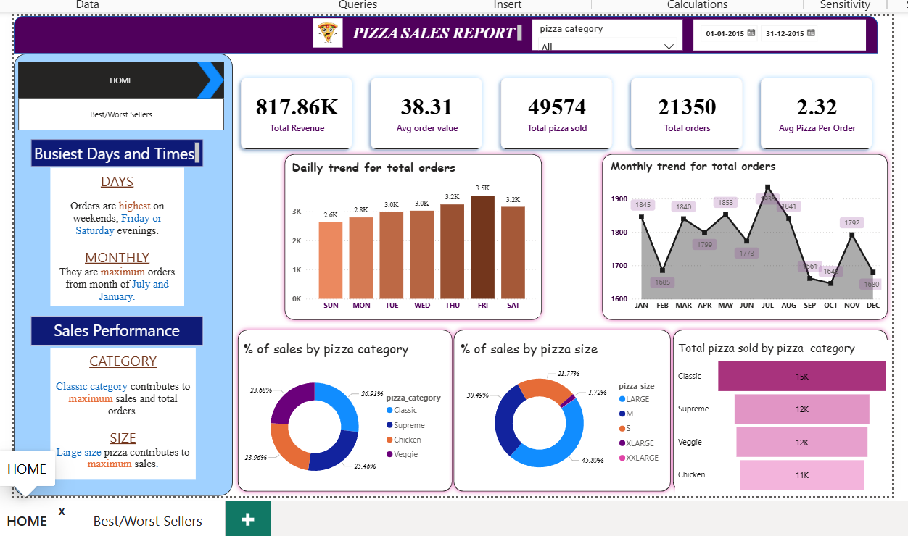

# 🍕 Pizza Sales Report – Power BI Dashboard

## 📌 Project Overview
An interactive Power BI dashboard built to analyze pizza sales data
and uncover business insights around revenue, customer preferences,
and ordering patterns.

## 🎯 Objective
To help a pizza business understand:
- Which pizzas are selling the most and least
- What time of day / day of week gets maximum orders
- Monthly and daily revenue trends
- Which category (Classic, Veggie, Supreme, Chicken) performs best

## 📊 Key Insights
- 📈 Identified peak order hours and busiest days of the week
- 🍕 Found top 5 best-selling and bottom 5 least-selling pizzas
- 💰 Tracked total revenue, average order value, and total orders
- 📅 Analyzed monthly sales trends across the year

## 🛠️ Tools Used
- Power BI Desktop
- Microsoft Excel (data source)
- DAX (for calculated measures and KPIs)

## 📸 Dashboard Preview

## 📁 Files in this Repository
- `pizza_sales.pbix` – Main Power BI dashboard file
- `pizza_sales_data.xlsx` – Raw data used for analysis
- `pizza_dashboard.png` – Dashboard screenshot

## 👩‍💻 Developed By
Praveena Maganti – Final Year B.Tech CSE
